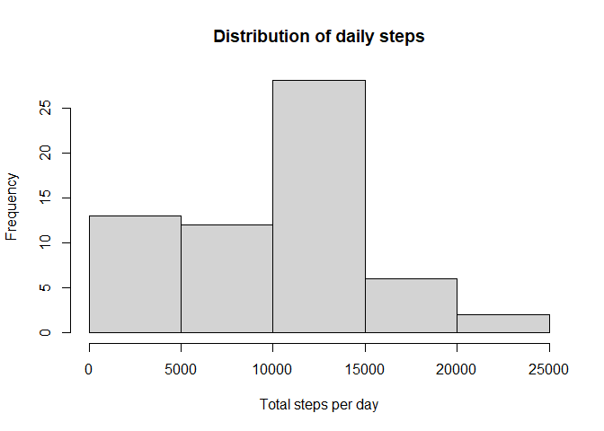
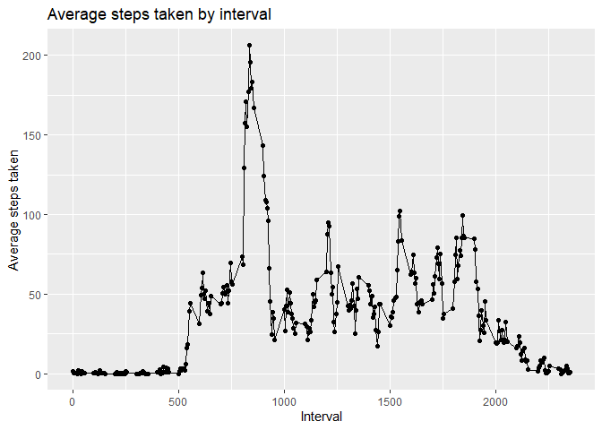
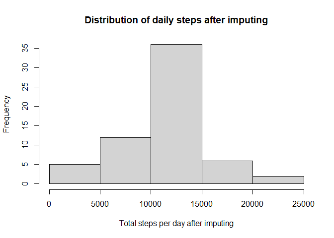
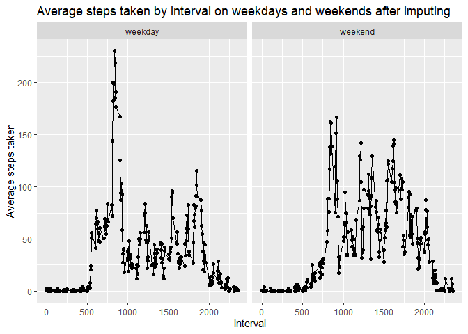

## Loading and preprocessing the data

Unzip and load the dataset, then transform the date into date class.


```r
activity <-  read.csv(unz('activity.zip','activity.csv'), 
                      colClasses = c('numeric', 'character', 'numeric'))
activity <- transform(activity, date = as.Date(date, '%Y-%m-%d'))
```

## What is mean total number of steps taken per day?

Calculate the total steps taken per day while removing NAs for now. The results are plotted in a histogram in frequency.


```r
total_steps <- with(activity, tapply(steps, date, sum, na.rm = T))
hist(total_steps, 
     xlab = 'Total steps per day', main = 'Distribution of daily steps')
```

<!-- -->

```r
mean_step <- mean(total_steps)
mean_step
```

```
## [1] 9354.23
```

```r
median_step <- median(total_steps)
median_step
```

```
## [1] 10395
```
The mean steps per day is 9354.2295082 steps and the median steps per day is 1.0395\times 10^{4} steps.

## What is the average daily activity pattern?

Calculate the average steps taken by the 5-minute interval and plot.


```r
library(dplyr)
```

```
## Warning: package 'dplyr' was built under R version 4.0.3
```

```
## 
## Attaching package: 'dplyr'
```

```
## The following objects are masked from 'package:stats':
## 
##     filter, lag
```

```
## The following objects are masked from 'package:base':
## 
##     intersect, setdiff, setequal, union
```

```r
library(ggplot2)

avg_steps_byint <- activity %>% group_by(interval) %>% 
    summarise(avg_steps = mean(steps, na.rm = T))
```

```
## `summarise()` ungrouping output (override with `.groups` argument)
```

```r
ggplot(avg_steps_byint, aes(interval, avg_steps)) + geom_point() + geom_line() + 
    xlab('Interval') + ylab('Average steps taken') + ggtitle('Average steps taken by interval')
```

<!-- -->

```r
max_int <- with(avg_steps_byint, interval[which.max(avg_steps)])
max_int
```

```
## [1] 835
```

The maximum steps are on average taken during the interval of 835 minutes.

## Imputing missing values


```r
na_count <- dim(activity %>% filter(is.na(steps)))[1]
na_count
```

```
## [1] 2304
```
There are 2304 entries with NA value for steps. Since there are cases where the whole day has no data available, we impute the NAs using the mean of the same 5-min interval from all others days that have available data. This is in fact stored in avg_steps_byint already.


```r
merged <- merge(activity, avg_steps_byint, by = 'interval')
imputed_data <- merged %>% 
    mutate(steps = if_else(is.na(steps),avg_steps, steps)) %>%
    select(steps, date, interval)
```

Now compute the mean and median, and plot the distribution of the imputed new dataset.


```r
new_total_steps <- with(imputed_data, tapply(steps, date, sum))
hist(new_total_steps,  
     xlab = 'Total steps per day after imputing', 
     main = 'Distribution of daily steps after imputing')
```

<!-- -->

```r
new_mean_step <- mean(new_total_steps)
new_mean_step
```

```
## [1] 10766.19
```

```r
new_median_step <- median(new_total_steps)
new_median_step
```

```
## [1] 10766.19
```
After imputing, the mean steps per day is 1.0766189\times 10^{4} steps and the median steps per day is 1.0766189\times 10^{4} steps. The imputing seems to affect more on the low step side, where likely most NAs are now positive numbers after imputing with the average.

## Are there differences in activity patterns between weekdays and weekends?

First group the data by weekdays and weekends, and then average the steps by interval. Finally, make a panel plot to compare trends on weekdays and weekends.


```r
weekday_data <- imputed_data %>% mutate(week = weekdays(date, abbreviate = T)) %>% 
    mutate(week = if_else(week %in% c('Sat', 'Sun'),'weekend','weekday')) %>%  
    mutate(week = as.factor(week)) %>%
    group_by(interval, week) %>%
    summarise(avg_steps = mean(steps))
```

```
## `summarise()` regrouping output by 'interval' (override with `.groups` argument)
```

```r
ggplot(weekday_data, aes(interval, avg_steps)) + geom_point() + geom_line() + facet_grid(.~week) +
    xlab('Interval') + ylab('Average steps taken') + ggtitle('Average steps taken by interval on weekdays and weekends after imputing')
```

<!-- -->
